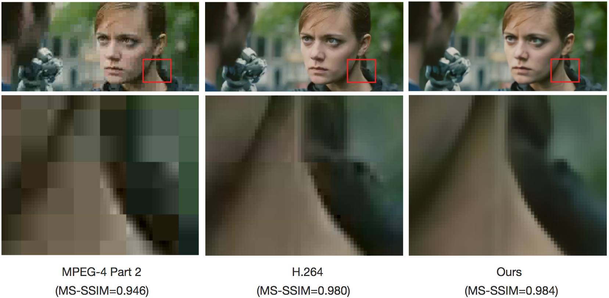
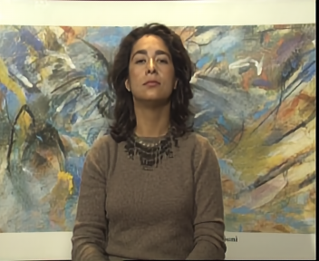

# Video Compression through Image Interpolation
[Chao-Yuan Wu](https://www.cs.utexas.edu/~cywu/),
[Nayan Singhal](http://www.cs.utexas.edu/~nayans/),
[Philipp Kr&auml;henb&uuml;hl](http://www.philkr.net/).  
In ECCV, 2018.
[[Project Page](https://chaoyuaw.github.io/vcii/)]
[[Paper](https://arxiv.org/abs/1804.06919)]
</img>

## Overview
PyTorch implementation of deep video compression codec.

Currently supported:
- Training interpolation models with different offsets.
- Evaluation on single model (PSNR/MS-SSIM).
- Some ablation study options.

Coming soon:
- Entropy coding.
- Evaluation on combined model.

## Dependency
We conducted experiments in the following environment:
 - Linux
 - Python 3.6.3
 - PyTorch 0.3.0.post4
 - TITAN X GPUs with CuDNN.

Similar environments (e.g. with OSX, Python 2) might work with small modification, but not tested.

## Getting started
We provide a demo training script which trains on 7 clips for 100 iterations, and evaluates on a hold-out clip.
To run the demo, please download the [demo data](https://drive.google.com/file/d/1ddmjU48TehTk28903cg2mSoLBgkeAcwY/view?usp=sharing),
and run `train.sh 2` (the argument (`0`, `1`, or `2`) specifies the level
of hierarchy).
This will take about 3 minutes.

Expected output:
```
Creating loader for data/train...
448 images loaded.
	distance=1/2
Loader for 448 images (28 batches) created.
	Encoder fuse level: 1
	Decoder fuse level: 1
...
[TRAIN] Iter[1]; LR: 0.00025; Loss: 0.260715; Backprop: 0.2985 sec; Batch: 2.8358 sec
[TRAIN] Iter[2]; LR: 0.00025; Loss: 0.237539; Backprop: 0.2371 sec; Batch: 1.5466 sec
[TRAIN] Iter[3]; LR: 0.00025; Loss: 0.241159; Backprop: 0.3445 sec; Batch: 1.4208 sec
[TRAIN] Iter[4]; LR: 0.00025; Loss: 0.193481; Backprop: 0.2328 sec; Batch: 1.3091 sec
[TRAIN] Iter[5]; LR: 0.00025; Loss: 0.181479; Backprop: 0.2336 sec; Batch: 1.2742 sec
...
[TRAIN] Iter[99]; LR: 0.00025; Loss: 0.090678; Backprop: 0.2444 sec; Batch: 1.3960 sec
[TRAIN] Iter[100]; LR: 0.00025; Loss: 0.082984; Backprop: 0.2431 sec; Batch: 1.3988 sec
Loss at each step:
0.1758 0.0982 0.0620 0.0574 0.0579 0.0597 0.0653 0.0742 0.0846 0.0949
...
Start evaluation...
...
Creating loader for data/eval...
8 images loaded.
	distance=1/2
Loader for 8 images (8 batches) created.
...
Evaluation @iter 100 done in 24 secs
TVL Loss   : 0.12207	0.06993	0.06193	0.06525	0.06742	0.07027	0.07543	0.08148	0.08650	0.09003
TVL MS-SSIM: 0.61841	0.81475	0.85905	0.87109	0.87745	0.88022	0.87903	0.87486	0.86880	0.86132
TVL PSNR   : 28.02937	28.63096	28.87302	28.87184	28.77673	28.64452	28.44989	28.28644	28.19869	28.15354
```

Output images with different number of
progression compression iterations
are stored in a directory called `output`.
It starts with the blurry output with 1 iteration:


to the better output with 10 iterations:


Since we've only trained the model for 3 minutes,
the results don't look great yet, but we can see that
it roughly starts to reconstruct the frames.

The final result using full training set will look like:




Please see our [Project Page](https://chaoyuaw.github.io/vcii/)
for more examples.

To train or evaluate on additional datasets,
please see [`DATA.md`](DATA.md) for details and instructions.

## Citation
If you find this model useful for your research, please use the following BibTeX entry.
<pre>
@inproceedings{wu2018vcii,
  title={Video Compression through Image Interpolation},
  author={Wu, Chao-Yuan and Nayan Singhal and Kr{\"a}henb{\"u}hl, Philipp},
  booktitle={ECCV},
  year={2018}
}
</pre>

## Acknowledgment
This implementation largely borrows from [pytorch-image-comp-rnn](https://github.com/1zb/pytorch-image-comp-rnn/) by [Biao Zhang (1zb)](https://github.com/1zb). U-net implementation borrows from [Pytorch-UNet](https://github.com/milesial/Pytorch-UNet/tree/master/unet) by [Milesi Alexandre](https://github.com/milesial).
Thank you, [Biao](https://github.com/1zb) and [Milesi Alexandre](https://github.com/milesial)!
